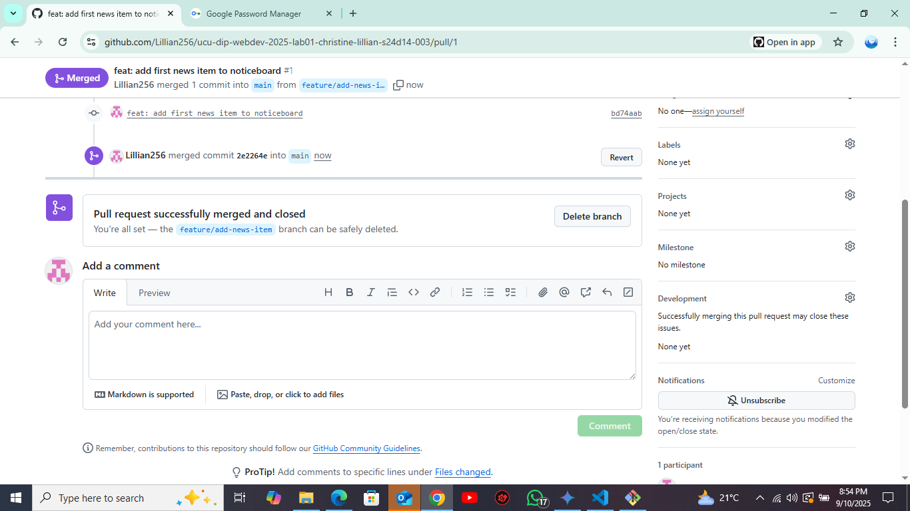

 # Lab 01 — Environment Setup & Git Workflow
 ## Tasks- [x] Install Node LTS, Git, VS Code- [x] Configure Git user and default branch- [x] Initialize repo and create semantic `index.html`- [x] Create `.gitignore` and `README.md`- [x] Open a Pull Request from a feature branch
 ## How to run
 Open `index.html` in a browser (or use VS Code Live Server).
 ## Screenshots[text](screenshots)
 [text](screenshots) 
 1) PR page  2) DevTools → Network tab (HTML request shows 200)
 ## Reflection (100–150 words)- What is an HTTP request/response?- Which status code did you see, and what does it mean?- One thing you learned about Git today.
 ## Reflection (100-150 words) An HTTP request/response is the fundamental process by which web browsers communicate with servers. A request is sent from the client (my browser) asking for a resource, and the server sends back a response containing the requested data and a status code,I saw a **200 OK** status code, which means the request for my HTML file was successful and the server delivered it without any issues[cite: 126, 149]. This is a good status code to see, as it confirms that my webpage is accessible.One of the most valuable things I learned about Git today is the concept of a pull request. It provides a formal process to propose changes and have them reviewed before they are merged into the main codebase[cite: 6, 123, 137]. This practice ensures code quality and avoids conflicts when multiple people are working on a project. Using a feature branch and a pull request made the process of adding a new item to the webpage organized and safe[cite: 119, 123].
s